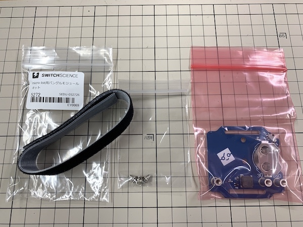
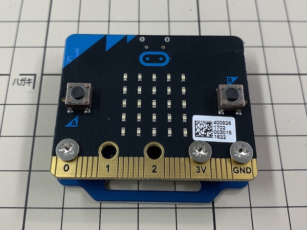
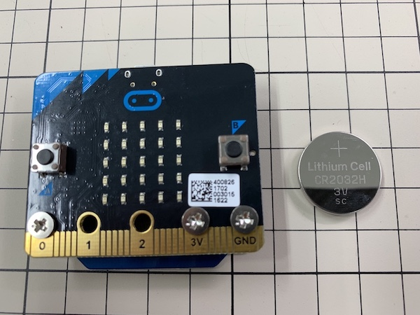
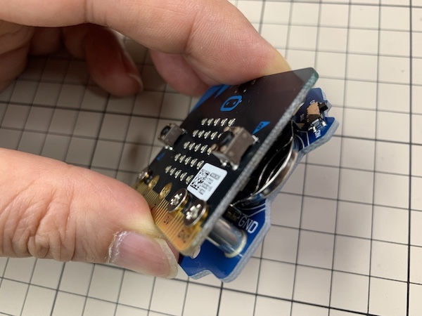
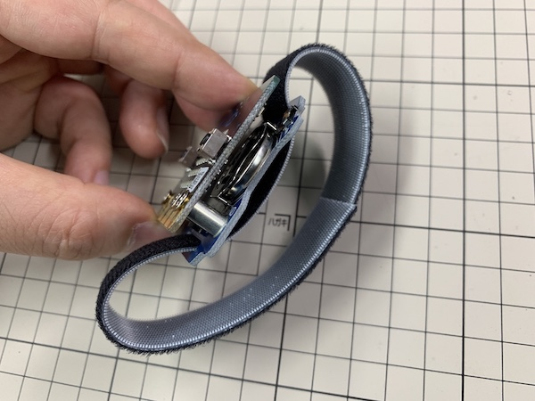
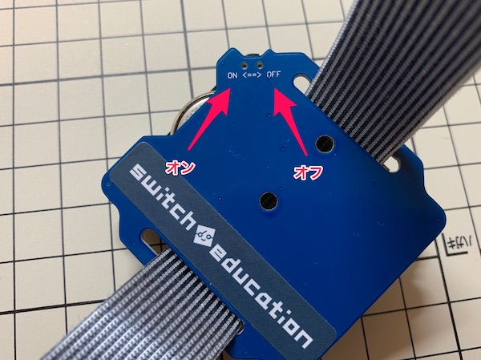

# バングルモジュールとマイクロビットをつなごう

## 使うもの
1. マイクロビット本体
2. バングルモジュール

## プログラム

音が出るプログラムを使おう

## 作り方

1. バングルモジュールをふくろから出す  

2. P0と3VとGNDをネジでしっかり止める  

3. ボタン電池の文字の面を上にして横から入れる  

4. ベルトをつけて完成  

## ちゅうい

### 電源スイッチについて

バングルモジュールは、ボタン電池でマイクロビットを動かします。電池をオン・オフにする小さいスイッチがついているので、動かすときだけオン（ON）にします。使わないときにはオフ（OFF）にしましょう。  

### スマホやタブレットでプログラムを書きこむとき

バングルモジュールを取り付けると、リセットボタンがおせなくなります。スマホやタブレットのアプリでプログラムを書きこむときは、`Aボタン`と`Bボタン`を押しながら、`電源スイッチを（ON）`にすると、ペアリングモードになります。

### 使わなくなったボタン電池は？

使わなくなった電池をすてるときは、住んでいる場所によってすて方が違うので注意しましょう。ボタン電池は、セロハンテープにつつんですてましょう。  

