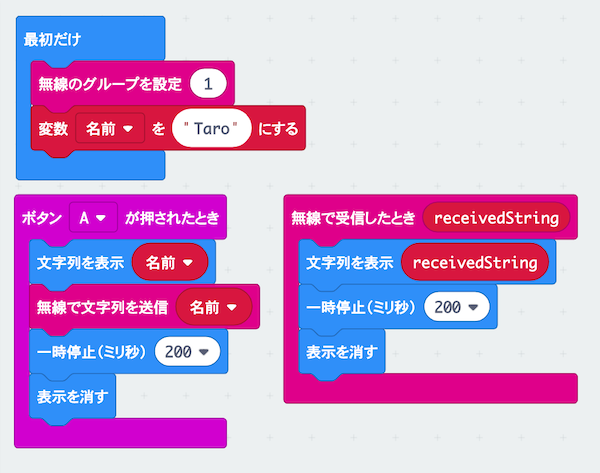

# ひみつの通信機を作ろう

## むずかしさ　★★★☆☆

## 使うもの
1. マイクロビット本体
2. 電池ボックス

## プログラム

* 変数`名前`を作るよ
* 変数`receivedString`は、`無線で受信したとき`ブロックからコピーしよう

プロジェクト： https://makecode.microbit.org/_DguRwWHPUVaC

## 作り方

1. プログラムをマイクロビットに書きこむ
2. 電池ボックスをつなぐ

## 使い方

* `Aボタン`をおすと、名前が画面にでるよ
* 名前は他の人のマイクロビットにもでるよ
* どこまではなれても通信できるかな？

