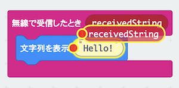

# ひみつの通信機を作ろう

## むずかしさ　★★★☆☆

## 使うもの
1. マイクロビット本体（2台以上）
2. 電池ボックス

## プログラム

プロジェクト： https://makecode.microbit.org/_DguRwWHPUVaC

## 作り方

1. 変数`名前`を作ります
2. `文字列を表示`ブロックの変数`receivedString`は、`無線で受信したとき`ブロックからコピー（変数をタップして移動）します

3. プログラムをマイクロビットに書きこみます
4. 電池ボックスをつなぎます

## 使い方

* Aボタンをおすと、名前が画面にでるよ
* 名前は他の人のマイクロビットにもでるよ
* どこまではなれても通信できるかな？
