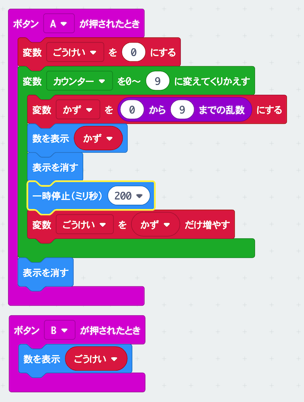

# フラッシュ暗算で遊ぼう

## むずかしさ　★★☆☆☆

## 使うもの
1. マイクロビット本体

## プログラム

プロジェクト： https://makecode.microbit.org/_Dv5ezU6ab1Jp

## 作り方

1. プログラムをマイクロビットに書きこむ

## 使い方

* Aボタンをおすと、0〜9の数字がでるよ
* 数字を全部足し算してみよう
* Bボタンをおすと答えがでるよ

## チャレンジ

* 数が出ている時間を変えてむずかしく（やさしく）してみよう

