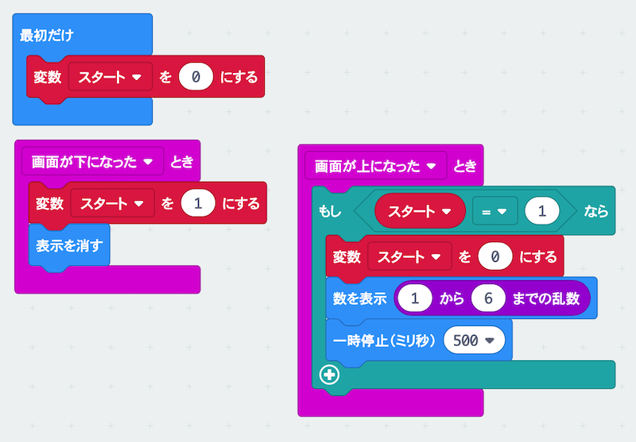
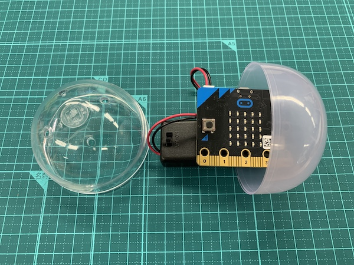
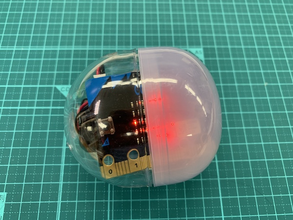

# サイコロを作ろう

## むずかしさ　★☆☆☆☆

## 使うもの
1. マイクロビット本体
2. 電池ボックス
3. ガチャガチャのカプセル

## プログラム

* 変数`スタート`を作るよ
* むらさき色の`乱数ブロック`は`計算`メニューにあるよ

プロジェクト： https://makecode.microbit.org/_eyYKLefCTY0w

## 作り方

1. プログラムをマイクロビットに書きこむ
2. 電池ボックスとつなぐ
3. LEDが外から見えるようにカプセルに入れる

## 使い方

* 転がして止まると1〜6の数字がでるよ

