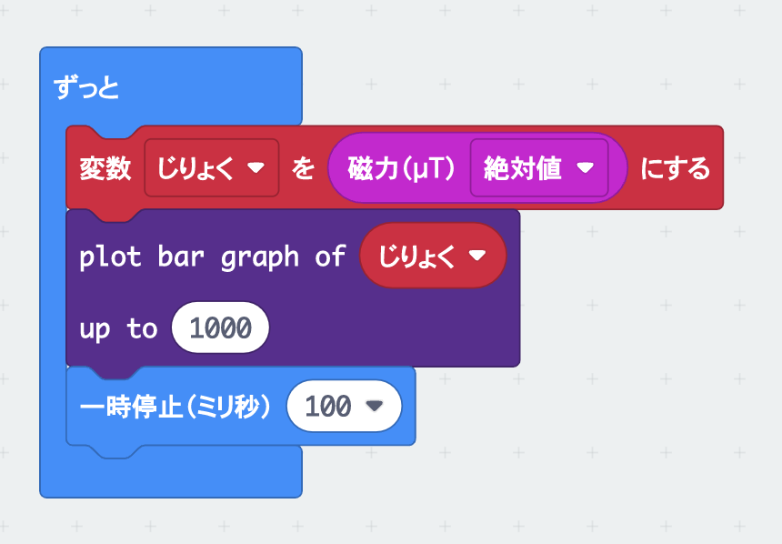

# じしゃくの力をはかろう

## むずかしさ　★☆☆☆☆

## 使うもの
1. マイクロビット本体

## プログラム

* 変数`じりょく`を作るよ

プロジェクト： https://makecode.microbit.org/_YWYLyThhL6Ta

## 作り方

1. プログラムをマイクロビットに書きこむ

## 使い方

* さいしょに動かすと`TILT TO FILL SCREEN`と出るので、かたむけてLEDで画面をぬりつぶそう
* マイクロビットのじしゃくのセンサ（電子コンパス）はうら側にあるよ
* マイクロビットのうら側を色んなところにかざしてみよう（パソコンとかスマホとか）
