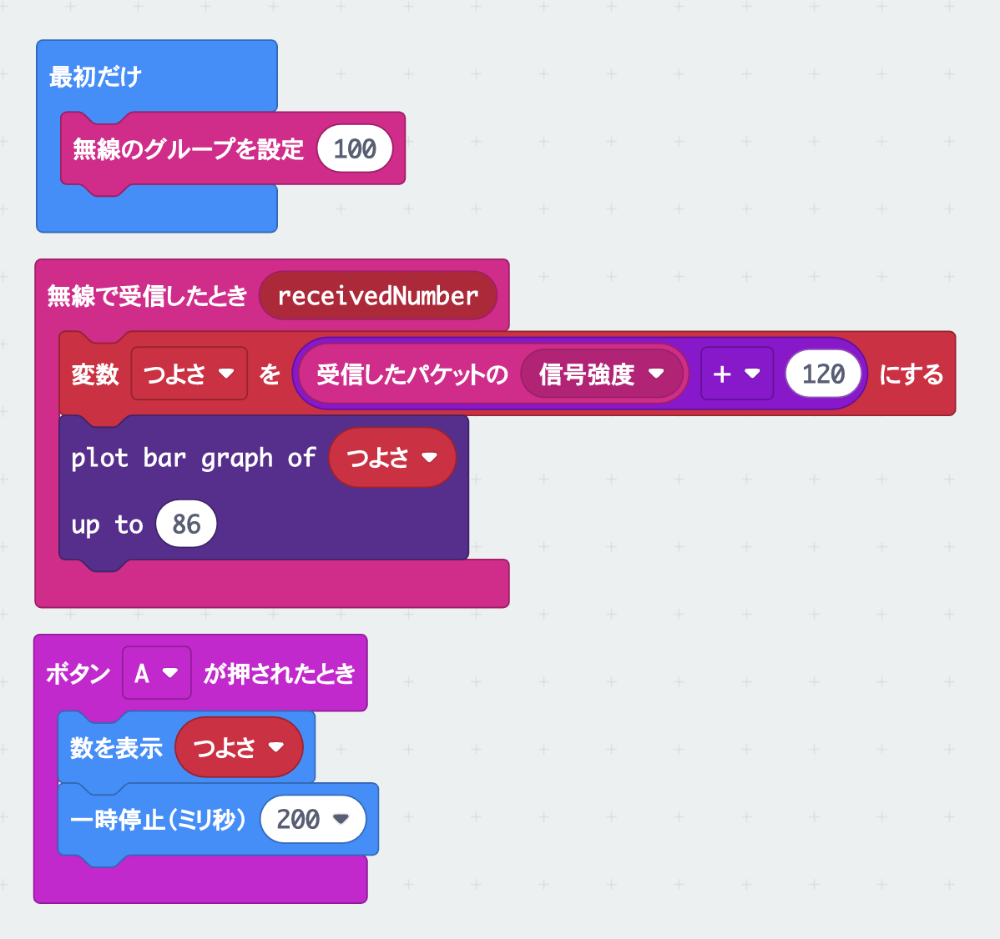

# たからさがしゲームで遊ぼう

## むずかしさ　★★★☆☆

## 使うもの
1. マイクロビット本体
2. 電池ボックス

## プログラム

プロジェクト： https://makecode.microbit.org/_KtRWwp3F1iLH

## 作り方

1. 変数`チャンネル`と`つよさ`を作ります
2. `plot bar graph of`のブロックは、LEDのメニューにあります
3. プログラムをマイクロビットに書きこみます
4. 電池ボックスをつなぎます

## 使い方

* たから箱に近づくと`つよさ`が大きくなって、画面が光るよ
* 画面が全部光るところに行ってたから箱をさがそう
* たから箱はワークショップの会場に三つあるよ！
* Aボタンをおすと、無線のグループが１〜3に切り替わるよ

## ヒント

* たから箱は2秒ごとに信号を出すよ（ゆっくり歩いてさがそう）
* たから箱は見える場所にあるよ（れいぞうこの中にはありません）
