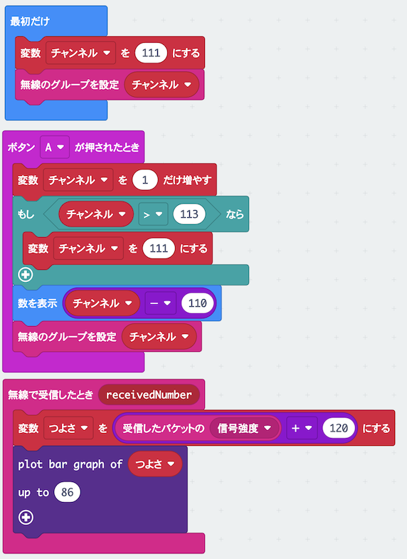

# たからさがしゲームを作ろう

## むずかしさ　★★★☆☆

## 使うもの
1. マイクロビット本体
2. 電池ボックス

## プログラム

* 変数`つよさ`を作るよ

プロジェクト： https://makecode.microbit.org/_EpTeKCY1wLyd

## 作り方

1. プログラムをマイクロビットに書きこむ
2. 電池ボックスをつなぐ

## 使い方

* たから箱に近づくと`つよさ`が大きくなって、画面が光るよ
* 画面が全部光るところに行ってたから箱をさがそう
* たから箱はワークショップの会場に三つあるよ！無線のグループは、`100`と`110`と`120`を使ってさがそう
